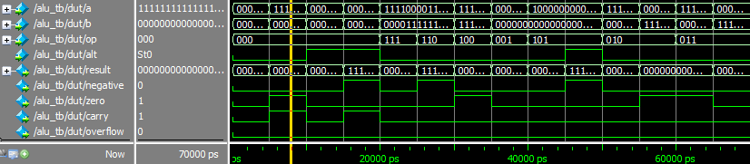

# RISC-V-CPU

# ---- alu testbench start ----
# PASS [1] op=000 alt=0 a=00000005 b=00000003 -> result=00000008
# PASS [2] op=000 alt=0 a=ffffffff b=00000001 -> result=00000000
# PASS [3] op=000 alt=1 a=0000000a b=00000004 -> result=00000006
# PASS [4] op=000 alt=1 a=00000003 b=00000005 -> result=fffffffe
# PASS [5] op=111 alt=0 a=f0f0f0f0 b=0ff00ff0 -> result=00f000f0
# PASS [6] op=110 alt=0 a=f0f0f0f0 b=0ff00ff0 -> result=fff0fff0
# PASS [7] op=100 alt=0 a=ffffffff b=ffffffff -> result=00000000
# PASS [8] op=001 alt=0 a=00000001 b=00000004 -> result=00000010
# PASS [9] op=101 alt=0 a=80000000 b=00000004 -> result=08000000
# PASS [10] op=101 alt=1 a=80000000 b=00000004 -> result=f8000000
# PASS [11] op=010 alt=0 a=ffffffff b=00000001 -> result=00000001
# PASS [12] op=010 alt=0 a=00000001 b=ffffffff -> result=00000000
# PASS [13] op=011 alt=0 a=ffffffff b=00000001 -> result=00000000
# PASS [14] op=011 alt=0 a=00000001 b=ffffffff -> result=00000001
# ---- alu testbench done: 14 tests, 0 errors ----
# ALL TESTS PASSED

