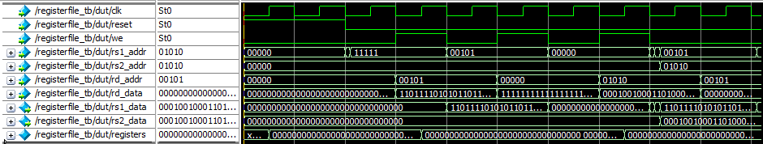

# RISC-V-CPU

# ---- alu testbench start ----
# PASS [1] op=000 alt=0 a=00000005 b=00000003 -> result=00000008
# PASS [2] op=000 alt=0 a=ffffffff b=00000001 -> result=00000000
# PASS [3] op=000 alt=1 a=0000000a b=00000004 -> result=00000006
# PASS [4] op=000 alt=1 a=00000003 b=00000005 -> result=fffffffe
# PASS [5] op=111 alt=0 a=f0f0f0f0 b=0ff00ff0 -> result=00f000f0
# PASS [6] op=110 alt=0 a=f0f0f0f0 b=0ff00ff0 -> result=fff0fff0
# PASS [7] op=100 alt=0 a=ffffffff b=ffffffff -> result=00000000
# PASS [8] op=001 alt=0 a=00000001 b=00000004 -> result=00000010
# PASS [9] op=101 alt=0 a=80000000 b=00000004 -> result=08000000
# PASS [10] op=101 alt=1 a=80000000 b=00000004 -> result=f8000000
# PASS [11] op=010 alt=0 a=ffffffff b=00000001 -> result=00000001
# PASS [12] op=010 alt=0 a=00000001 b=ffffffff -> result=00000000
# PASS [13] op=011 alt=0 a=ffffffff b=00000001 -> result=00000000
# PASS [14] op=011 alt=0 a=00000001 b=ffffffff -> result=00000001
# ---- alu testbench done: 14 tests, 0 errors ----
# ALL TESTS PASSED

 ---- regfile testbench start ----
# PASS [1] read x5 -> rs1_data=00000000
# PASS [2] read x31 -> rs1_data=00000000
# PASS [3] read x5 -> rs1_data=deadbeef
# PASS [4] read x0 -> rs1_data=00000000
# PASS [5] read x5 -> rs1_data=deadbeef
# PASS [6] read x10 -> rs1_data=12345678
# PASS [7] dual read x5/x10 -> rs1=deadbeef rs2=12345678
# PASS [8] read x5 -> rs1_data=deadbeef
# PASS [9] same-address dual read match: rs1=12345678 rs2=12345678
# ---- regfile testbench done: 9 tests, 0 errors ----
# ALL TESTS PASSED

# ---- imm_gen testbench start ----
# PASS [1] I-type +5: instruction=00508293 -> immediate=00000005
# PASS [2] I-type -1: instruction=fff08293 -> immediate=ffffffff
# PASS [3] LOAD +100: instruction=06412183 -> immediate=00000064
# PASS [4] JALR +4: instruction=004100e7 -> immediate=00000004
# PASS [5] STORE +20: instruction=00512a23 -> immediate=00000014
# PASS [6] STORE -4: instruction=fe512e23 -> immediate=fffffffc
# PASS [7] BRANCH +8: instruction=00208463 -> immediate=00000008
# PASS [8] BRANCH -4: instruction=fe209ee3 -> immediate=fffffffc
# PASS [9] LUI 0x12345: instruction=123452b7 -> immediate=12345000
# PASS [10] AUIPC 0xFFFFF: instruction=fffff317 -> immediate=fffff000
# PASS [11] JAL +16: instruction=010000ef -> immediate=00000010
# PASS [12] JAL -16: instruction=ff1ff0ef -> immediate=fffffff0
# PASS [13] R-type default: instruction=002081b3 -> immediate=00000000
# ---- imm_gen testbench done: 13 tests, 0 errors ----
# ALL TESTS PASSED